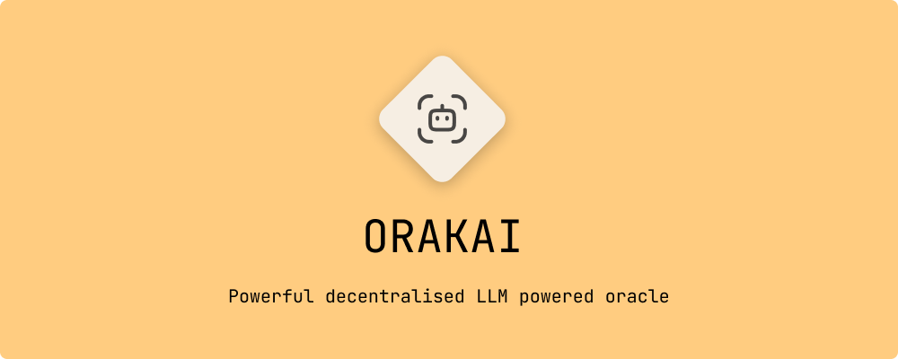
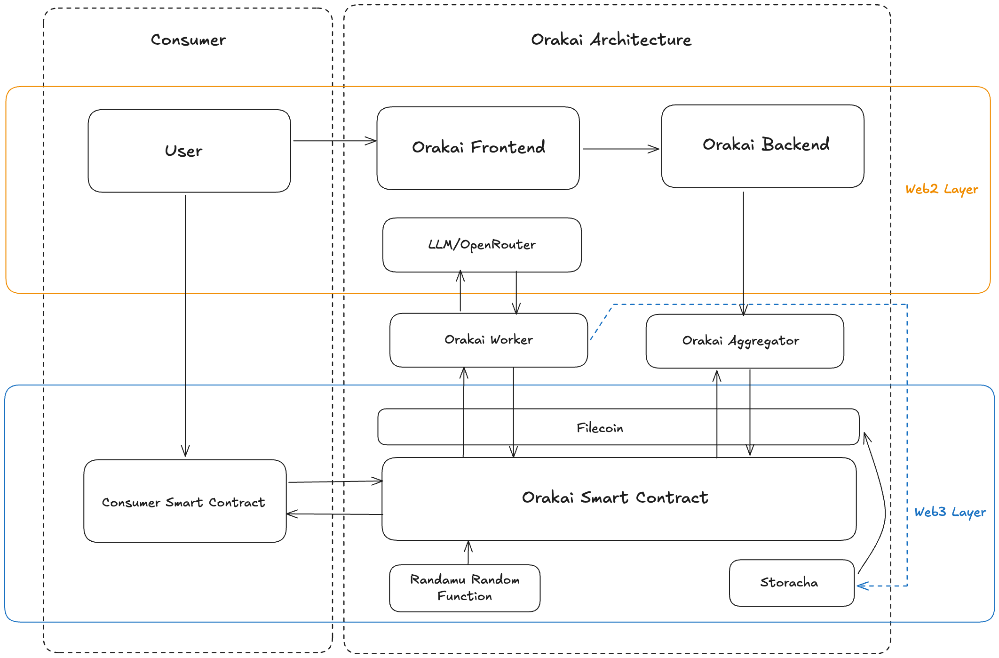

# Orakai: The decentralised AI-Oracle for web3. Ask. Verify. Trust.



## What is Orakai?
Orakai is a revolutionary decentralized AI oracle network that bridges the gap between smart contracts and artificial intelligence. By combining cutting-edge technologies like OpenRouter.ai for LLM processing, Storacha for decentralized storage, Randamu for verifiable randomness, and the Checker Subnet for governance, Orakai creates a trustless, secure, and efficient pipeline for AI-powered data streams in Web3 applications.


> Read the whitepaper [here](https://staging-assets.kofferx.com/orakai_whitepaper.pdf)

## Features
- **First-Class Decentralized AI Oracle**: Orakai sets a new standard for AI oracles with its robust, trustless architecture
- **Modular Architecture**: 
  - Plug-and-play components that can be customized and extended
  - Independent worker, aggregator, and checker networks
  - Flexible integration points for custom AI models and storage solutions
  - Easy to upgrade and maintain individual components without affecting the entire system
- **Cross-Chain Compatibility**:
  - EVM-based smart contracts deployable across multiple chains
  - Standardized interfaces for seamless integration
  - Chain-agnostic worker network
  - Unified API for cross-chain query management
- **Agentic Economy**:
  - Multi-model interaction framework
  - AI agents can collaborate and compete in the network
  - Dynamic model selection based on task requirements
  - Incentivized participation for different AI models
  - Reputation system for model performance tracking
- **Secure & Verifiable**: Leverages Randamu for random function verification and Checker Subnet for governance
- **Community-Driven**: Anyone can create and deploy their own AI-powered data streams
- **Composable & Flexible**: Seamlessly integrates with EVM-compatible smart contracts
- **Reputation-Based**: Sophisticated worker reputation system ensures quality and reliability
- **Cost-Efficient**: Optimized gas usage and flexible worker participation models

## Use Cases
- **Prediction Markets**: AI-powered market analysis and forecasting
- **DeFi**: Automated risk assessment and market sentiment analysis
- **Gaming**: Dynamic content generation and fair randomness
- **Governance**: AI-assisted proposal analysis and voting recommendations
- **NFTs**: Intelligent metadata generation and verification
- **Autonomous Agents**: AI-driven decision making for smart contracts

## Architecture



### End to End flow

1. **User creates a query** through the frontend.
2. The **backend** stores query metadata and emits a job for workers.
3. The **smart contract** uses **Randamu** to randomly select eligible workers.
4. Selected **workers** independently run the query against OpenRouter LLMs and submit signed results.
5. Responses are uploaded to **Storacha/Filecoin** for transparency.
6. The **aggregator** waits for a quorum and submits the final agreed result.
7. The **smart contract emits** the response event.
8. The **consumer smart contract** reads and uses the result.

### Core Components

1. **Smart Contract Layer**
   - EVM-compatible contracts for query requests and responses
   - Randamu integration for verifiable randomness
   - Secure callback mechanisms for consumer contracts

2. **Backend Services**
   - User management and project creation
   - Query metadata storage and retrieval
   - Worker registration and management

3. **Aggregator Network**
   - Response validation and quorum establishment
   - Worker reputation management
   - Result finalization and submission

4. **Worker Network**
   - OpenRouter.ai integration for LLM processing
   - Storacha for decentralized data storage
   - Signature verification and response submission

5. **Checker Subnet**
   - Decentralized governance
   - Worker verification and reputation scoring
   - Penalty enforcement and rewards distribution

### Technology Stack
- **OpenRouter.ai**: Gateway for LLM processing and AI inference
- **Storacha**: Decentralized storage solution for response data
- **Randamu**: On-chain randomness for quorum selection and load balancing
- **Checker Network**: Decentralized governance and reputation system

## Potential Growth
- **Multi-Aggregator Network**: Enhanced decentralization through aggregator DAO
- **zkML Integration**: Zero-knowledge proofs for LLM inference verification
- **Token Economy**: Native token for staking, slashing, and payments
- **Query NFTs**: Decentralized query registry through NFT ownership
- **Cross-Chain Expansion**: Support for multiple blockchain networks
- **Advanced AI Models**: Integration with cutting-edge AI technologies

## Getting Started

1. Clone the repository:
```bash
git clone https://github.com/your-org/orakai.git
cd orakai
```

2. Install dependencies:
```bash
bun install
```

3. Configure environment variables:
```bash
cp .env.example .env
# Fill in your environment variables
```

4. Start development server:
```bash
bun dev
```

## Support
We welcome contributions from the community! Here's how you can help:

- ⭐ Star the repository if you find it useful
- 🐛 Report bugs by opening issues
- 💡 Suggest new features
- 🔧 Submit pull requests
- 📣 Spread the word about Orakai

Join our community and help shape the future of decentralized AI oracles!